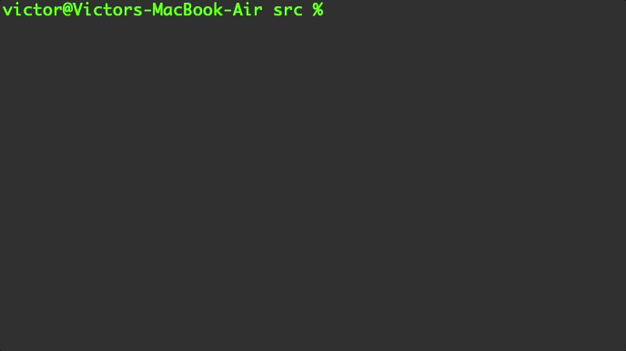

# Investment Growth Calculator

## A simple CLI tool that calculates investment growth using compound interest and (optional) recurring contributions.

This project was built to help streamline the process of calculating the future value of an investment.
The tool runs in the terminal and guides users through entering investment details step-by-step.



## How to install and run this project

> Make sure you have Java 17 or later installed. You can check your version with:
> ```bash
> java -version
> ```

1. **Clone the repository**  
   ```bash
   git clone https://github.com/your-username/investment-growth-calculator.git
   ```

2. **Navigate to the project directory and create an output folder**
   ```bash
   cd investment-growth-calculator
   mkdir out
   ```
   
3. **Compile the program**
   ```bash
   javac -d out src/Main.java
   ```

4. **Run the program**  
   ```bash
   java -cp out Main
   ```

## Planned features include:
- Flexible support for contribution frequency
- Contributions vs total growth comparison
- Inflation adjusted returns